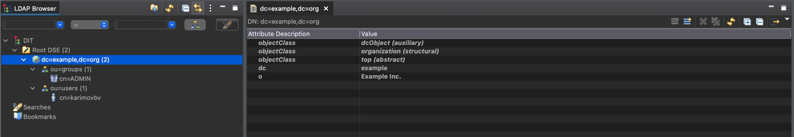
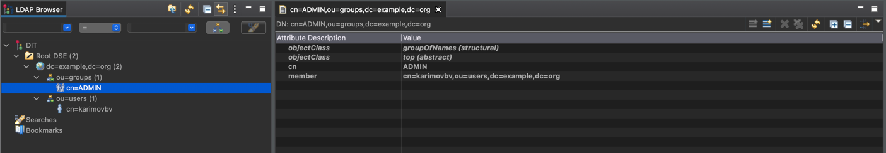
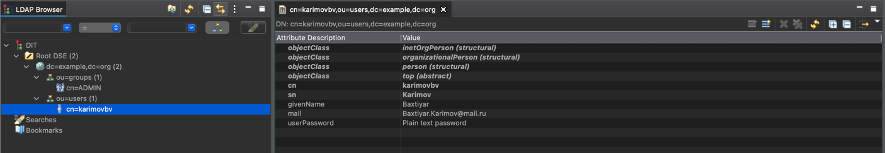
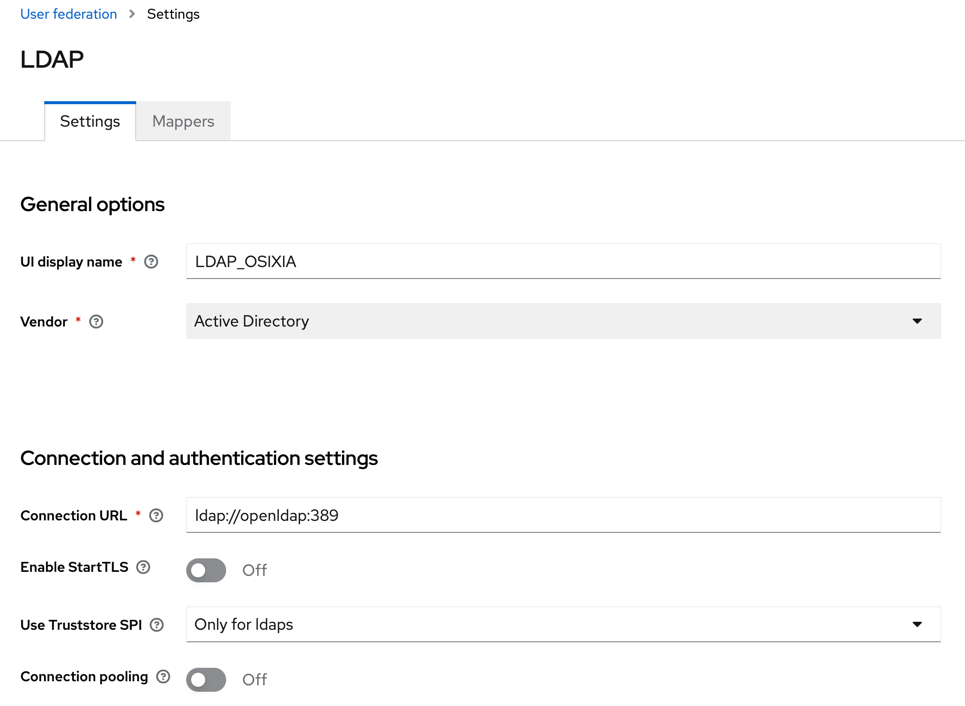
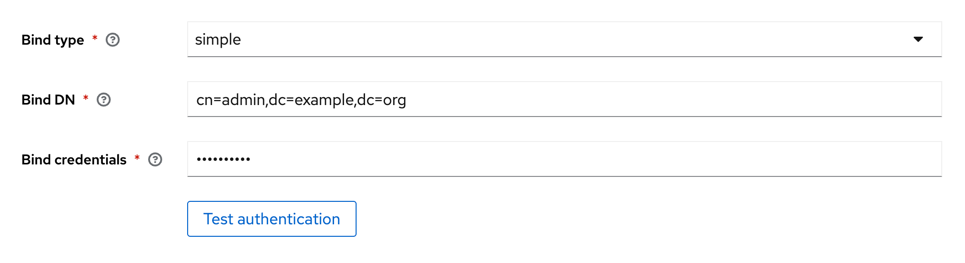
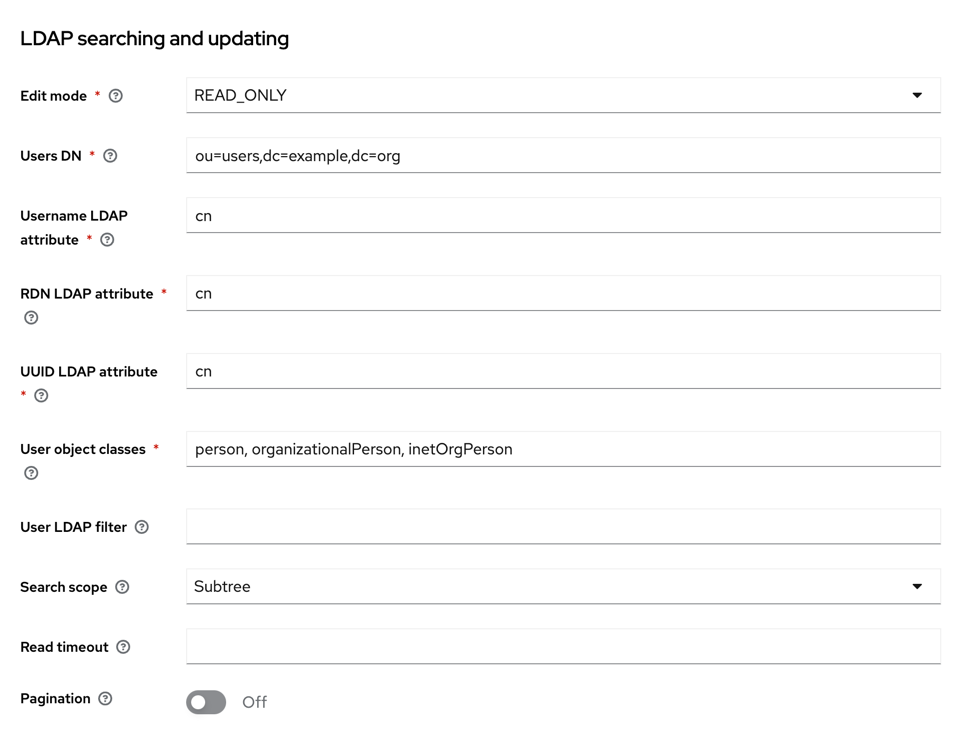

# demo-ldap-security

The demo application is used to test Spring Security features with
Active Directory (OpenLDAP)-integrated Keycloak in Java using Spring Boot.

* First you need to make sure that your OpenLdap and Keycloak servers are up and running.
    * You can find docker-compose file under the `/infra` package that will help you with above stuff.
* Customize the newly created LDAP server by adding users and user groups accordingly, either using LDIF files or by
  manual.
    * E.g.  
      Root organisation:
      
      User groups:
      
      Users:
      
      And you are done with the LDAP server.

* You need to configure your Keycloak server to use LDAP user groups as roles for Keycloak users.  
  To achieve this, add a new User Federation provider with the LDAP type and configure it.
  Provide the LDAP server connection and authentication settings, as well as the LDAP searching and updating properties.
  Additionally, set up synchronization settings.
    * E.g.  
      Connection:  
        
      Authentication:  
        
      Searching and updating:  
       